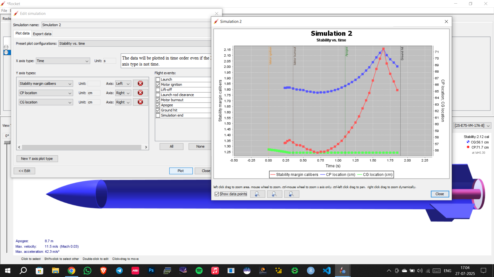

# 🚀 Rocket Stability Prediction using Machine Learning & Synthetic Data

A research-oriented machine learning project focused on predicting the **stability of model rockets** using **simulation-based data (OpenRocket)** combined with **advanced data augmentation techniques (SMOTE variants)**.

---

## 📌 Overview

This project aims to solve a key challenge in rocketry:

> ⚠️ *Can we predict whether a rocket will be stable before launch using only design & environmental parameters?*

Instead of relying solely on real-world data (which is limited), this project leverages:

- 🧪 **OpenRocket simulation data**
- 🔁 **Synthetic data generation**
- 🤖 **Machine Learning & Neural Networks**

---

## 🧠 Key Features

- 📊 Uses **OpenRocket simulation outputs**
- 🔁 Applies **SMOTE, SMOTE-NC, and Borderline-SMOTE**
- ⚖️ Handles **class imbalance effectively**
- 🤖 Implements:
  - Random Forest
  - Neural Networks (Deep Learning)
- 📈 Focus on **research novelty rather than just accuracy**

---

## 📂 Dataset

### 🔹 Source
- Generated using **OpenRocket simulations**

### 🔹 Includes:
- Aerodynamic parameters
- Stability-related metrics
- Environmental conditions

### 🔹 Example Simulation

---

## 🔄 Data Augmentation Techniques

To overcome limited and imbalanced data:

### 1. SMOTE
- Generates synthetic samples for minority classes

### 2. SMOTE-NC
- Handles mixed data types (categorical + numerical)

### 3. Borderline-SMOTE
- Focuses on samples near decision boundaries

> These techniques significantly improve model robustness and generalization.

---

## ⚙️ Models Used

### 🌲 Random Forest
- Strong baseline model
- Handles non-linearity well

### 🧠 Neural Network
- Captures complex relationships
- Suitable for high-dimensional data

